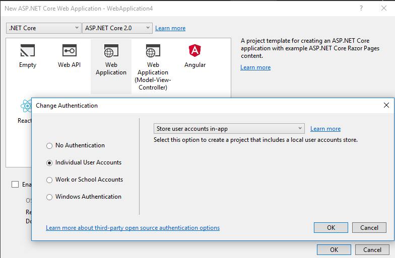
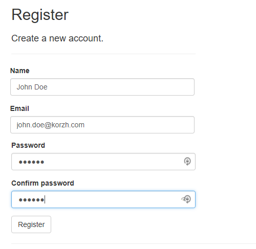
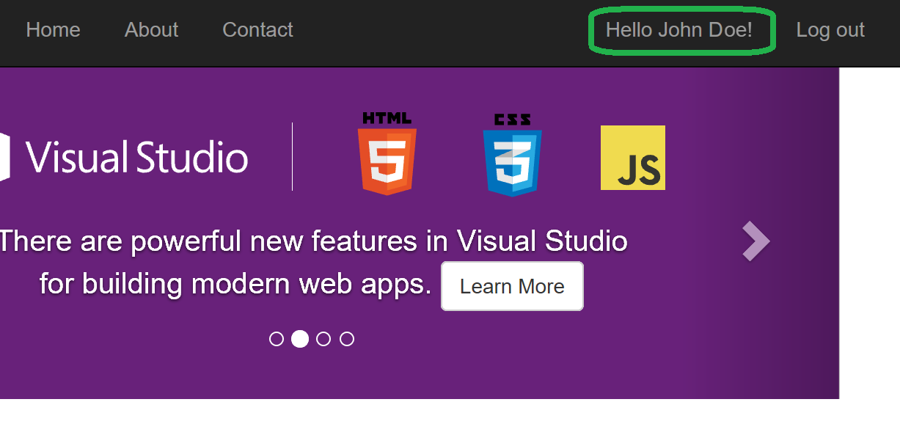

> __NB__: The solution presented in this article will work in version 2.0 of ASP.NET Core only!    
> If you use a newer version of ASP.NET Core (e.g. 2.2) - here is a [new post on the same topic](../2019-05-07-add-extra-user-claims-aspnet-core-webapp/index.md).

## Introduction
With this post, we start a series of articles that describe the different aspects of using ASP.NET Identity in your ASP.NET (Core) applications.
All the code in the following articles was built for and tested with ASP.NET Core 2.0. However, in most cases, it will work well in earlier versions of .NET framework (4.x) and ASP.NET Identity library (2.x)

One more note. We are NOT going to do an introduction to or describe the basic principles of ASP.NET Core in general or APS.NET Identity in particular. The following material is more for the developers who already have some experience with both of them. If you don't - please start by reading the tutorials on [ASP.NET Core documentation](https://docs.microsoft.com/en-us/aspnet/core/) website and creating your first web app with it.

<!-- trunc -->

## Problem
Let's suppose we created a new ASP.NET Core project using one of the default templates and chose "Individual user account" option for "Authentication".



Now when we start that newly created project and register new user we will see something like `Hello YourEmailAddress@YourCompany.com` in the top right part of the index web-page.

Obviously, such kind of greeting is useless in a real-world application and you would like to see the name of the currently logged user there instead (e.g. `Hello John Doe`).  
Let's figure out how to do it.

## Solution
Here we guess you are already familiar with the claims and [claims-based approach](https://docs.microsoft.com/en-us/aspnet/core/security/authorization/claims) for authorization used in ASP.NET Core Identity. If not - please read [ASP.NET Core Security](https://docs.microsoft.com/en-us/aspnet/core/security/) documentation first.

To achieve our goal we need to do 2 things:
1. Add necessary information to the list of claims stored with the user's identity.
2. Have a simple way of getting that info when needed.

But before implementing these two tasks we will need to add a new ContactName field to our model class and update our registration and user management pages accordingly.

### 0. Preparations: ContactName property in ApplicationUser and updated views
Let's add a new `ContactName` property to the ApplicationUser model class (you can find it in `Models` folder of your project):

```c#
public class ApplicationUser : IdentityUser {
    public string ContactName { get; set; }
}
```
Of course, you can add here some other properties you would like to store with your user's account, like `FirstName`, `LastName`, `Country`, `Address`, etc. but for simplicity, we will consider only one additional property.

The next step will be adding a new migration and updating your database.
Just run the following commands from the terminal windows in your project's folder:

```shell
dotnet ef migrations add ContactNameField
````
and then
```shell
dotnet ef database update
```

Finally, we will need to add the new field to the views:

1. `Models\AccountViewModels\RegisterViewModel.cs`
```c#
public class RegisterViewModel
{
    [Required]
    [Display(Name = "Name")]
    public string ContactName { get; set; }
   .     .     .     .     .     .
```

2. `Views/Account/Register.chstml`
   Add the following piece of markup before `Email` form group
```html
<div class="form-group">
    <label asp-for="ContactName"></label>
    <input asp-for="ContactName" class="form-control" />
    <span asp-validation-for="ContactName" class="text-danger"></span>
</div>
````

3. `Controllers/AccountController`
   Update the following line in the Register method:

```c#
var user = new ApplicationUser { ContactName=model.ContactName, UserName = model.Email, Email = model.Email };
```

After that, perform the similar steps in
- `View/Manage/Index.cshtml`,
- `Models/ManageViewModels/IndexViewModel.cs`
  and in
- `Index` method in `ManageControler` class.

Try to run your project and open the registration page. Now it should look this way:



Now, when all the preparations are finished we can return back to our main tasks.

### 1. Adding a user's name to the claims
It appears that the main task is much easier than all the preparations we made before. :)

The quickest way to add some additional claims to the user's identity is to create your own implementation of `IUserClaimsPrincipalFactory` and register it in DI container.

Here is the implementation of `IUserClaimsPrincipalFactory` which adds the value stored in `ContactName` property to the user's claims:

```c#
public class MyUserClaimsPrincipalFactory : UserClaimsPrincipalFactory<ApplicationUser, IdentityRole>
{
    public MyUserClaimsPrincipalFactory(
        UserManager<ApplicationUser> userManager,
        RoleManager<IdentityRole> roleManager,
        IOptions<IdentityOptions> optionsAccessor)
        : base(userManager, roleManager, optionsAccessor) {
    }

    protected override async Task<ClaimsIdentity> GenerateClaimsAsync(ApplicationUser user) {
        var identity = await base.GenerateClaimsAsync(user);
        identity.AddClaim(new Claim("ContactName", user.ContactName ?? ""));
        return identity;
    }
} 
```

And then register it in DI container in `ConfigureServices` methods of your Startup class:

```c#
public void ConfigureServices(IServiceCollection services) {
    .     .     .     .      . 
    services.AddIdentity<ApplicationUser, IdentityRole>()
        .AddEntityFrameworkStores<ApplicationDbContext>()
        .AddDefaultTokenProviders();
     
    //add the following line of code
    services.AddScoped<IUserClaimsPrincipalFactory<ApplicationUser>, MyUserClaimsPrincipalFactory>();
    .     .     .     .      . 
} 
```

### 2. Accessing new claim from the views
Now we have a new claim associated with our user's identity. That's fine. But how we can get it and render on our view(s)?
Easy. Any view in your application has access to `User` object which is an instance of `ClaimsPrincipal` class.

This object actually holds the list of all claims associated with the current user and you can call its `FindFirst` method to get the necessary claim and then read the `Value` property of the found claim.

So, we just need to open `_LoginPartical.cshtml` file in `Views/Shared/` folder and replace the following line:

```html
<a asp-area="" asp-controller="Manage" asp-action="Index" title="Manage">Hello @UserManager.GetUserName(User)!</a>
```
with this one:

```html
<a asp-area="" asp-controller="Manage" asp-action="Index" title="Manage">Hello @(User.FindFirst("ContactName").Value)!</a>
```
Now you instead of something like `Hello john.doe@yourcompany.com` at the top of your web-page you should see something like this:



